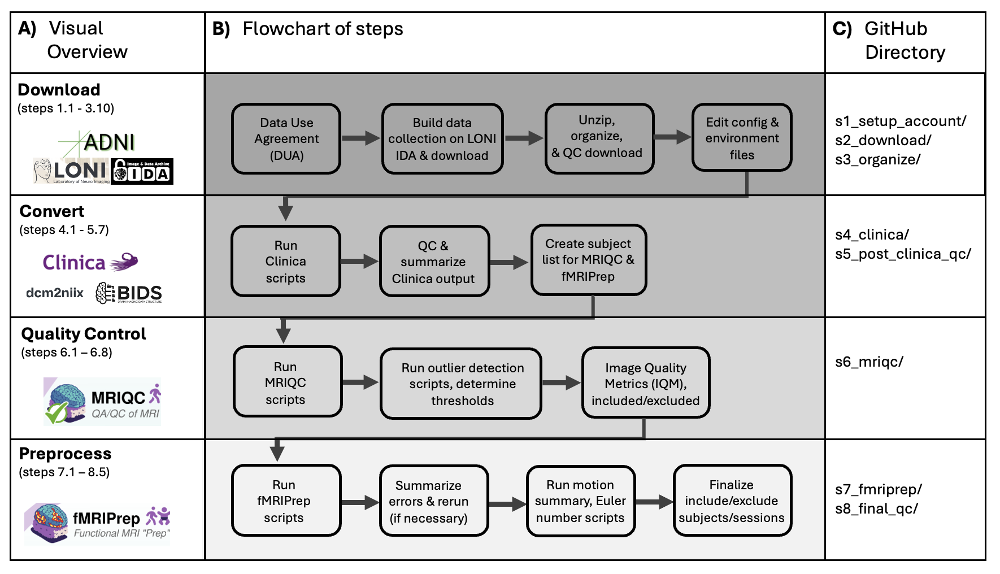
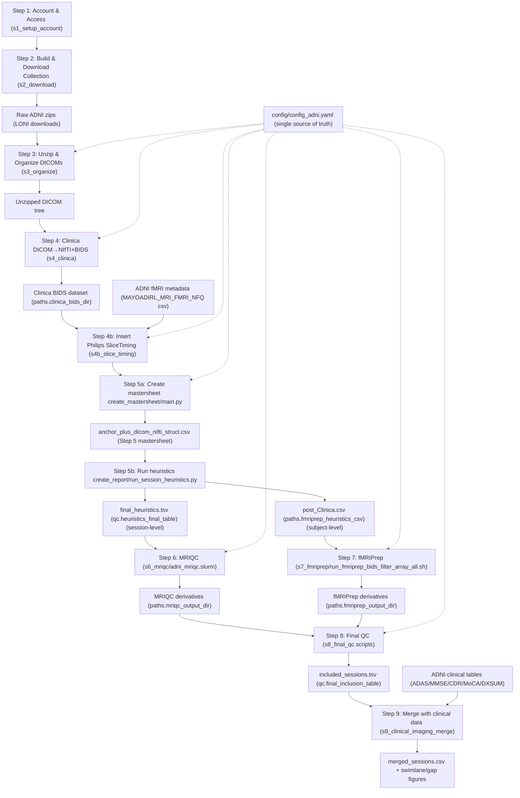

## [Update: 15.07.2026] Issues identified on 25.06.26 have been resolved. If you use the repo and discover any problems, please use issues to let us know.

# Alzheimer's Disease Neuroimaging Initiative (ADNI) resting-state functional MRI protocol

This repository contains detailed instructions and scripts for accessing, downloading, converting DICOMs to NIfTI, organizing data into BIDS format, running MRIQC, preprocessing data with fMRIPrep, and QC-ing the ADNI resting-state fMRI data.

This protocol is for ADNI 2, GO, and 3 resting-state fMRI (it also uses the T1w and, if available, T2w images for subjects with fMRI). ADNI 1 does not have rs-fMRI and we did not (yet) process ADNI 4 because Clinica (the software we use for converting DICOM to NIfTI and BIDS-ifying the data) does not yet handle ADNI 4.

The output of this protocol is high-quality, preprocessed rs-fMRI data in fs-LR 91k (plus MNI, fsnative, and fsaverage5) space, ready for downstream analyses.

## Quick start

1. Obtain ADNI access and sign the DUA.
2. Clone this repository and create an environment from `env/env_adni.yml`.
3. Edit `config/config_adni.yaml` with your local paths, container locations, and cluster settings.
4. (Optional but recommended) Skim the step-specific READMEs below to understand manual vs automated pieces.
5. Download data via the LONI IDA web UI following `s1_setup_account/README.md` and `s2_download/README.md`.
6. Run the automated steps directly using the scripts described in each step's `README.md` (`s3_organize/`, `s4_clinica/`, `s4b_slice_timing/`, `s5_post_clinica_qc/`, `s6_mriqc/`, `s7_fmriprep/`, `s8_final_qc/`).
7. Inspect QC reports and tables in `s5_post_clinica_qc/`, `s6_mriqc/`, `s7_fmriprep/`, and `s8_final_qc/`.
8. Use the final inclusion tables (for example, `included_sessions.tsv`) for downstream analyses.
9. (Optional) Merge the included sessions with ADNI clinical assessments and visualize the imaging↔clinical alignment via `s9_clinical_imaging_merge/`.

All automated steps are driven by `config/config_adni.yaml`. Paths, container images, and most Slurm settings are read at runtime via `utils.config_tools` rather than hardcoded in scripts. Adjust that YAML for your environment instead of editing code where possible.

We attempted to make this process as automated and reproducible as possible. We document the errors we encountered at every step, provide insight on how we troubleshoot and fix the errors, and describe where manual intervention is needed. At some steps, like quality checking, there are decisions that may differ across research groups running this protocol. We attempted to justify and transparently explain all decisions made on inclusion/exclusion based on automated QC metrics. We provide tables describing the sample size at every step, including how many subjects/sessions were dropped after a QC decision was made.

The repo is organized around a series of numbered steps (`s1_…` through `s9_…`, plus an interstitial `s4b_slice_timing/`), described and linked below. Each step has its own subdirectory with a `README.md` that contains detailed instructions for that step, including the relevant scripts. Steps 1–8 produce the preprocessed data and inclusion tables; Step 9 is a downstream step that merges the included sessions with ADNI clinical data.

## Pipeline overview (Mermaid)

## Step 1.) Account and Access

See `s1_setup_account/README.md`.

## Step 2.) Build and download image collection

See `s2_download/README.md`.

## Step 3.) Unzip, organize, and QC download

See `s3_organize/README.md`.

## Step 4.) Run Clinica (DICOM→NIfTI and BIDS-ify)

See `s4_clinica/README.md`.

## Step 4b.) Insert SliceTiming into Philips scans

See `s4b_slice_timing/README.md`. Clinica/`dcm2niix` cannot recover slice timing
from most Philips DICOMs, so their BOLD sidecars lack `SliceTiming` and fMRIPrep
skips slice-time correction. This step fills `SliceTiming` from the ADNI fMRI
metadata table (`MAYOADIRL_MRI_FMRI_NFQ`). Run it after the merged BIDS tree
exists and before Step 5.

## Step 5.) Post-Clinica Quality Control

See `s5_post_clinica_qc/README.md`.

## Step 6.) MRIQC

See `s6_mriqc/README.md`.

## Step 7.) fMRIPrep

See `s7_fmriprep/README.md`.

## Step 8.) Final Quality Control

See `s8_final_qc/README.md`.

## Step 9.) Merge imaging sessions with clinical data

See `s9_clinical_imaging_merge/README.md`. This downstream step joins the final
included imaging sessions to the ADNI clinical assessments (ADAS-Cog, MMSE, CDR,
MoCA, and diagnosis), matching each scan to its nearest clinical visit, and
writes a merged session table plus interactive swimlane and imaging↔clinical gap
figures.
